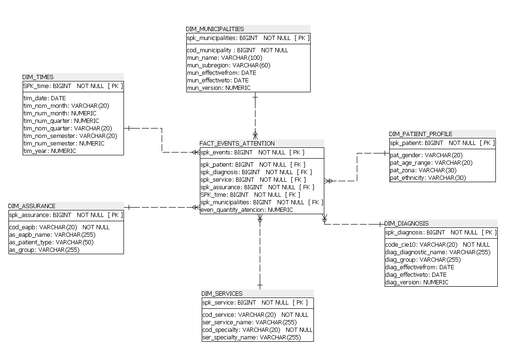
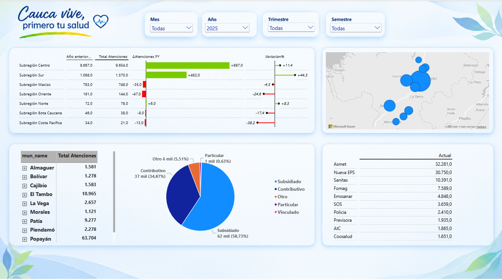

# Análisis de Morbilidad – Modelo Dimensional, ETL y Dashboard en Power BI

Proyecto desarrollado en el marco de la **Especialización en Administración de la Información y Bases de Datos**, que cubre el ciclo completo de un proyecto de arquitectura de datos: modelado dimensional, procesos de ETL y construcción del tablero analítico final.




## Objetivo

Diseñar e implementar una solución de inteligencia de negocios para el análisis de la morbilidad, que permita identificar tendencias de atenciones en salud a lo largo del tiempo, comparar periodos (año actual vs. año anterior) y explorar la información por diagnóstico, servicio, especialidad, ubicación y perfil del paciente.

## Arquitectura del proyecto

El proyecto sigue el flujo clásico de un data warehouse dimensional:

```
Fuente de datos (Excel)  →  ETL (Apache Hop)  →  Modelo dimensional en SQL Server  →  Dashboard Power BI
```

- **Fuente:** archivos Excel entregados como insumo de origen.
- **ETL:** extracción, limpieza y transformación de los datos, generación de llaves subrogadas (surrogate keys), manejo de actualización histórica mediante SCD tipo 2, y carga hacia las tablas de hechos y dimensiones.
- **Modelo dimensional:** esquema estrella con una tabla de hechos y siete dimensiones, implementado en SQL Server.
- **Dashboard:** tablero interactivo en Power BI con segmentadores dinámicos y medidas DAX de inteligencia de tiempo.

## Modelo dimensional

| Tabla | Tipo | Descripción |
|---|---|---|
| `FACT_EVENTS_ATTENTION` | Hecho | Registros y medidas asociadas a las atenciones en salud |
| `DIM_TIMES` | Dimensión | Calendario completo (día, mes, trimestre, semestre, año) |
| `DIM_SERVICES` | Dimensión | Servicios asociados a las atenciones |
| `DIM_DIAGNOSIS` | Dimensión | Clasificación e información de los diagnósticos |
| `DIM_SPECIALTY` | Dimensión | Especialidad médica asociada a cada atención |
| `DIM_MUNICIPALITIES` | Dimensión | Catálogo de municipios del Cauca, agrupados por regla de negocio |
| `DIM_PATIENT_PROFILE` | Dimensión | Perfil del paciente (rango de edad, género, etnia, tipo de paciente) |
| `DIM_ASSURANCE` | Dimensión | Información de aseguramiento y EAPB |

> Diagrama del modelo disponible en `docs/modelo-dimensional.png`.

## Proceso ETL

Resumen de las transformaciones aplicadas antes de cargar los datos al modelo, desarrolladas en **Apache Hop**:

1. Extracción de los datos fuente desde los archivos Excel.
2. Limpieza y estandarización de tipos de datos.
3. Generación de llaves subrogadas para relacionar las dimensiones con la tabla de hechos.
4. Manejo de cambios históricos en las dimensiones mediante **SCD tipo 2**.
5. Construcción de la dimensión de tiempo (`DIM_TIMES`) con atributos de año, mes, trimestre y semestre.
6. Poblamiento (data populating) de las tablas dimensionales y de hechos en el motor de base de datos SQL Server.

## Dashboard

El tablero **"Cauca vive, primero tu salud"** permite:

- Filtrar por Mes, Año, Trimestre y Semestre.
- Visualizar el total de atenciones y su distribución por diagnóstico.
- Comparar cada periodo contra el mismo periodo del año anterior (PY) y calcular la variación porcentual.

### Medidas DAX principales

```DAX
Total Atenciones = COUNTROWS(FACT_EVENTS_ATTENTION)

Atenciones PY = 
CALCULATE(
    [Total Atenciones],
    FILTER(
        ALL(DIM_TIMES),
        DIM_TIMES[tim_date] IN SAMEPERIODLASTYEAR(VALUES(DIM_TIMES[tim_date]))
    )
)

Variación PY = [Total Atenciones] - [Atenciones PY]

Variación PY % = DIVIDE([Variación PY], [Atenciones PY], BLANK())
```

## Tecnologías y herramientas utilizadas

**Base de datos y modelado**
- SQL Server — almacenamiento e implementación del modelo dimensional.
- SQL — consultas, transformación y manipulación de datos.
- SQL Architect — diseño y modelado de la estructura de la base de datos.
- Modelado dimensional — diseño del esquema estrella y definición de dimensiones y tabla de hechos.

**Integración y transformación de datos**
- Apache Hop — desarrollo de los procesos ETL.
- Excel — fuente de datos.
- SCD Tipo 2 — manejo de cambios históricos en dimensiones.

**Business Intelligence**
- Power BI Desktop — construcción del modelo analítico y del dashboard.
- DAX (Data Analysis Expressions) — creación de medidas e indicadores.
- Inteligencia de tiempo — comparación de periodos y análisis temporal.

## Estructura del repositorio

```
├── modelo/
│   ├── scripts/
│   └── modelo-dimensional.png
│
├── etl/
│   ├── pipelines/
│   └── documentacion/
│
├── dashboard/
│   └── morbilidad.pbix
│
├── docs/
│   ├── modelo-dimensional.png
│   └── dashboard-preview.png
│
└── README.md
```

## Autor

**Cristian Andrés Pipicano Ruiz**
Proyecto desarrollado como parte de la Especialización en Administración de la Información y Bases de Datos.

## Licencia

Este proyecto está bajo la licencia MIT — ver el archivo [LICENSE](LICENSE) para más detalles.


